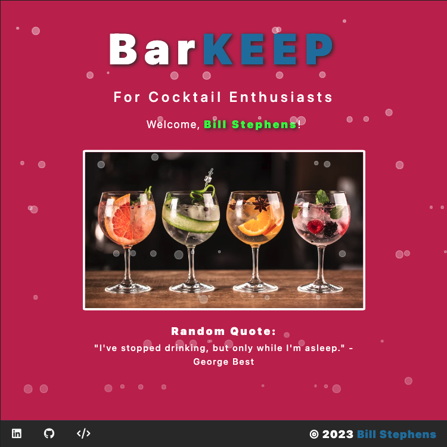
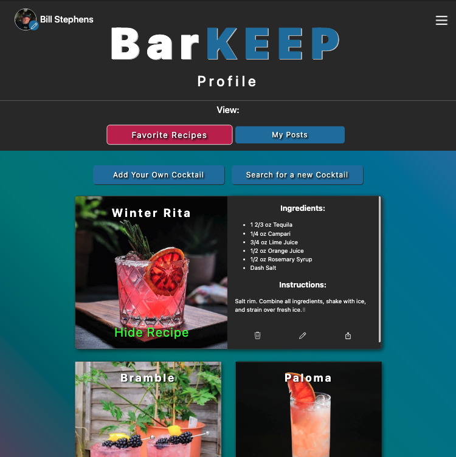

# BarKEEP 

## Description

Full MERN stack application for Cocktail Enthusiasts. Search API for cocktail recipes, add to favorites, share recipes with the community.   Post about cocktails, comment on and like other enthusiasts' posts, and more!

App Screenshots:

## Table of Contents

- [Installation](#installation)
- [Usage](#usage)
- [License](#license)
- [Contributing](#contributing)
- [Tests](#tests)
- [Questions](#questions)

## Installation

deployed app URL:  https://barkeep-842cb6903459.herokuapp.com/

## Usage

Register / Sign in or Sign in As Guest to test drive the app.  

## License
This application is covered under the MIT License.
 For more information: https://opensource.org/licenses/MIT

## Contributing
N/A

## Tests
N/A

## Questions
Contact Info 
GitHub user name: BillStephens2022 
Link to GitHub profile: https://github.com/BillStephens2022 
Email: stephensbill17@gmail.com

